<h1 align="center">FaithEyes: Towards Faithful Tool Use via<br/>Multi-Agent Process-Image Self-Verification</h1>

<p align="center">
  <a href="https://arxiv.org/abs/2607.28225"></a>
  <a href="https://hf.co/collections/Jackwang111/faitheyes"></a>
  <a href="https://modelscope.cn/collections/whq1111/FaithEyes"></a>
  <a href="https://github.com/Mosi-AI/FaithEyes"></a>
</p>

<p align="center">
  <b>Haoqing Wang, Xingrun Xing, Ziheng Li, Jianyuan Guo, Yehui Tang<sup>✉</sup></b><br/>
  Samsung Research, Beijing &nbsp;&nbsp;·&nbsp;&nbsp; Peking University &nbsp;&nbsp;·&nbsp;&nbsp; City University of Hong Kong
</p>

---

## 📰 News

- **[2026.09.29]** 🎉 The model checkpoints are now open-sourced on [Hugging Face](https://hf.co/collections/Jackwang111/faitheyes) and [ModelScope](https://modelscope.cn/collections/whq1111/FaithEyes)!

---

## 🔍 Overview

Agentic vision-language models (VLMs), which interleave textual reasoning with explicit tool calls such as cropping and code-based image manipulation, have emerged as a compelling paradigm for reliable and interpretable multi-modal reasoning. However, such models often use tools **unfaithfully**: many process images are irrelevant to the question (e.g., the crops miss the queried target), yet the tool call still receives full credit and the model still answers correctly by shortcutting through prior knowledge or random guessing. Such decorative or misaligned tool calls waste computation and reveal that the model does not faithfully use the evidence it retrieves. We attribute this to two coupled causes:

1. **Undifferentiated tool reward** — the bonus is granted on the co-occurrence of a correct answer and a tool call, regardless of whether the process image actually helps;
2. **Usefulness-agnostic feedback** — the tool observation returns only the process image, with no signal of whether the retrieved evidence is relevant.

To this end, we introduce **FaithEyes**, a multi-agent self-judging framework. The model itself serves as a **subagent** that judges each process image produced by the **main agent**:

- The verdict `{"is_helpful": true/false, "reasons": ...}` is **injected into the tool observation** to steer subsequent reasoning. Helpful images are returned with their judgement; unhelpful ones are **discarded** and replaced by their judgement only, which both curtails interference from spurious visual content and reduces the visual-token cost of invalid tool calls.
- The same verdict **scales the tool reward** by the helpful-tool ratio, $r_{\mathrm{tool}} = 1 - (n_{\mathrm{fail}} + n_{\mathrm{unhelpful}}) / n_{\mathrm{tool}}$, so that decorative calls earn nothing — suppressing reward hacking.

Because the subagent is the model itself (under a separate prompt), the judgement is available at inference with **no external model dependency**, keeping train-test consistency.

<p align="center">
  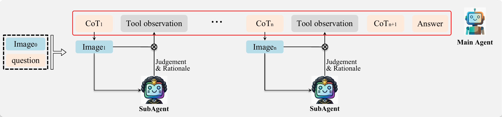
</p>

**Training.** A two-stage **SFT + RL** pipeline on adapted open-source data: the cold-start SFT stage equips the model with code-based tool use, faithfulness judging, and feedback-driven reasoning; the RL stage (GRPO) combines accuracy, format, consistency, and faithfulness-targeting tool rewards.

---

## ✨ Main Results

**Benchmarks (Avg@10).** The best result among agentic VLMs is **bolded** and the second best is <u>underlined</u>.

| Models | Tools | Size | V<sup>*</sup> | HR-Bench 4K | HR-Bench 8K | MathVista | MathVerse | MathVision |
| :--- | :---: | :---: | :---: | :---: | :---: | :---: | :---: | :---: |
| **Proprietary Models** | | | | | | | | |
| GPT-4o | - | - | 64.4 | 63.1 | 61.3 | 63.7 | 35.3 | 35.9 |
| **VLM w/o Tools** | | | | | | | | |
| Qwen2.5-VL | - | 7B | 75.0 | 68.6 | 63.6 | 67.9 | 45.5 | 21.4 |
| Qwen2.5-VL | - | 32B | 87.9 | 73.9 | 70.4 | 72.2 | 40.0 | 35.2 |
| Qwen3-VL | - | 8B | 86.4 | 78.9 | 74.6 | 77.2 | 62.1 | 53.9 |
| **Agentic VLM (Qwen2.5-VL-7B)** | | | | | | | | |
| DeepEyes | Crop | 7B | 84.3 | 74.2 | 70.4 | 68.7 | 44.3 | 28.3 |
| Pixel-Reasoner | Crop | 7B | 84.3 | 74.0 | 66.9 | 71.2 | 46.9 | 26.3 |
| Thyme | Code | 7B | 82.7 | 74.6 | 69.6 | 69.9 | 44.4 | 28.6 |
| CodeV | Code | 7B | 84.8 | 76.1 | 71.3 | <u>71.8</u> | 49.2 | **33.6** |
| PyVision-Image | Code | 7B | **88.7** | **78.1** | **74.3** | - | **55.8** | 28.7 |
| **FaithEyes (Ours)** | Code | 7B | <u>87.4</u> | <u>77.8</u> | <u>72.9</u> | **73.1** | <u>51.0</u> | <u>29.9</u> |
| **Agentic VLM (Qwen3-VL-8B)** | | | | | | | | |
| BEE | Latent | 8B | 90.6 | 80.2 | 76.8 | - | - | - |
| **FaithEyes (Ours)** | Code | 8B | 89.9 | 83.2 | 78.5 | 78.7 | 67.6 | 46.1 |

### Tool faithfulness

<p align="center">
  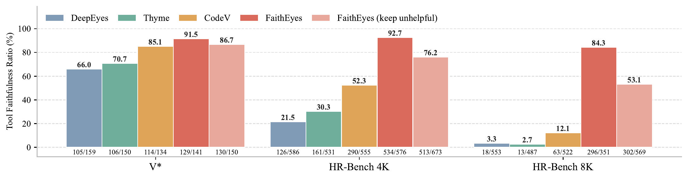
</p>

FaithEyes obtains a substantially higher tool faithfulness ratio than the agentic baselines (e.g., **86.7 / 76.2 / 53.1** on V<sup>*</sup> / HR-Bench 4K / HR-Bench 8K vs. **72.2 / 33.5 / 4.6** without our two mechanisms). Even under the stricter *keep-unhelpful* protocol (no self-judged-unhelpful image is dropped), FaithEyes still outperforms the strongest baseline (CodeV) by **1.6~41 points** across the three benchmarks — the gains reflect a genuinely more faithful tool-use policy, not a filtering artifact. For the 8B model, the faithfulness ratio reaches **91.6 / 81.6 / 70.8** under keep-unhelpful and **96.1 / 94.6 / 91.2** under drop-unhelpful.

### Inference cost

| | V<sup>*</sup> | | HR-Bench 4K | | HR-Bench 8K | |
| :--- | :---: | :---: | :---: | :---: | :---: | :---: |
| **Models** | Response tokens | Tool calls | Response tokens | Tool calls | Response tokens | Tool calls |
| DeepEyes | 4726 | 1.0 | 15499 | 1.0 | 16514 | 1.0 |
| Thyme | 5339 | 1.0 | 15328 | 1.0 | 17955 | 1.1 |
| CodeV | 5340 | 1.3 | 22505 | 3.2 | 31088 | 3.1 |
| **FaithEyes** | **4020** | **0.9** | **12580** | **0.9** | **14269** | **0.8** |

Each self-judging step costs only ~1.5k tokens, yet lets the main agent avoid multi-round re-cropping and carry fewer process images across turns. Compared with CodeV, FaithEyes saves **24.7% / 44.1% / 54.1%** tokens on V<sup>*</sup> / HR-Bench 4K / HR-Bench 8K.

---

## 🔬 Ablations & Analysis

### Does the missing usefulness signal matter?

Injecting an external-model judgement of process images into the tool observations of DeepEyes and Thyme (without any retraining) already improves accuracy on most benchmarks — evidence that the judgement supplies decision-relevant information the model previously failed to extract from the process image alone. But the gains are not uniform, so the judging and reasoning behaviors need to be **learned jointly**.

| Model | V<sup>*</sup> | HR-Bench 4K | HR-Bench 8K | MathVista | MathVerse | MathVision |
| :--- | :---: | :---: | :---: | :---: | :---: | :---: |
| DeepEyes | 84.3 | 74.2 | 70.4 | 68.7 | 44.3 | 28.3 |
| DeepEyes w/ Judgement | 86.2 ↑1.9 | 73.9 ↓0.3 | 68.1 ↓2.3 | 69.3 ↑0.6 | 46.8 ↑2.5 | 28.6 ↑0.3 |
| Thyme | 82.7 | 74.6 | 69.6 | 69.9 | 44.4 | 28.6 |
| Thyme w/ Judgement | 85.8 ↑3.1 | 75.5 ↑0.9 | 70.7 ↑1.1 | 71.4 ↑1.5 | 46.1 ↑1.7 | 29.6 ↑1.0 |

### Model design ablation

Average accuracy and tool faithfulness ratio (keep-unhelpful protocol) when ablating the two mechanisms:

| Model Design | Perception | Reasoning | V<sup>*</sup> | HR-Bench 4K | HR-Bench 8K |
| :--- | :---: | :---: | :---: | :---: | :---: |
| FaithEyes | **79.4** | **51.3** | **86.7** | **76.2** | **53.1** |
| w/o Judgement injection | 77.8 | 49.5 | 78.8 | 57.0 | 15.7 |
| w/o Reward scaling | 78.1 | 50.2 | 75.5 | 40.8 | 9.8 |
| w/o Both | 76.2 | 48.4 | 72.2 | 33.5 | 4.6 |
| w/ Qwen3-VL-235B-A22B judge | 79.7 | 51.2 | 88.3 | 78.6 | 56.2 |

The two mechanisms are **complementary rather than redundant**: *reward scaling* provides the incentive that drives the model to produce helpful crops, while *judgement injection* provides the scaffold that lets the model recognize and act on them. The incentive is unactionable without the scaffold, and the scaffold is ignored without the incentive. Replacing the self-judging subagent with a far stronger external judge (Qwen3-VL-235B-A22B) leaves accuracy essentially unchanged yet lifts faithfulness — the self-judging already keeps the accuracy with **no external dependency at inference**, and the remaining gap marks an upper bound a stronger judge can approach.

### Tool reward coefficient λ<sub>tool</sub>

<p align="center">
  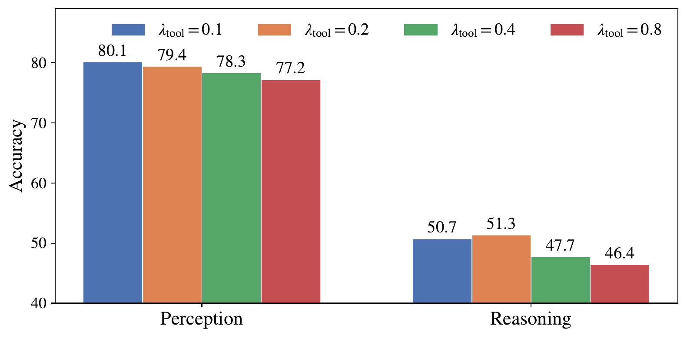
  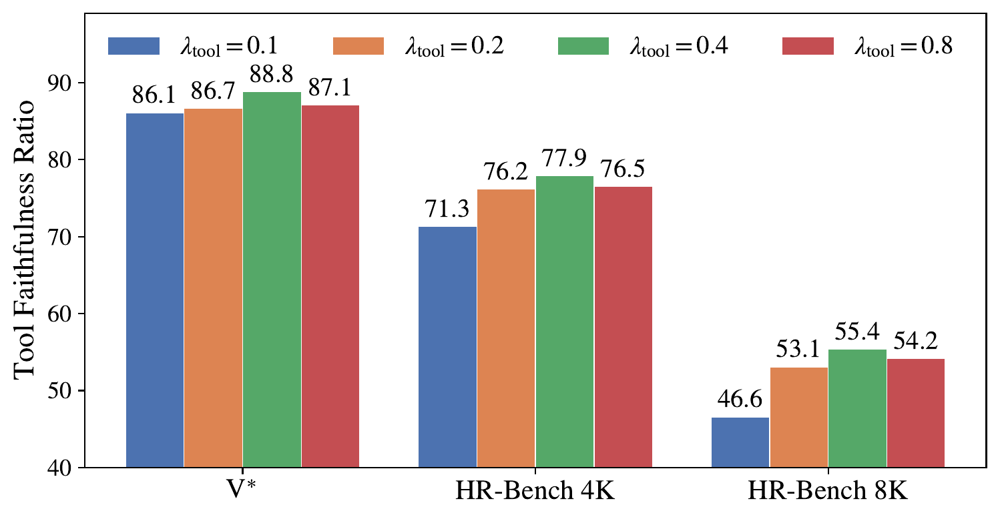
  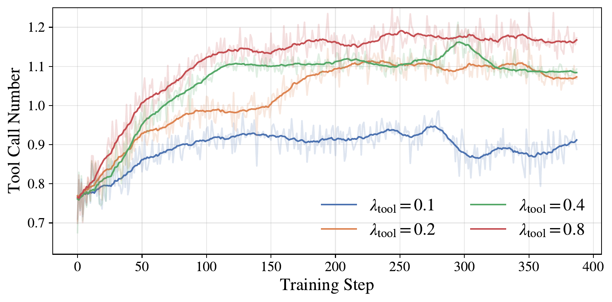
</p>

The method is robust over a wide range of $\lambda_{\mathrm{tool}} \in \{0.1, 0.2, 0.4, 0.8\}$. Accuracy peaks at $\lambda_{\mathrm{tool}}=0.2$ and degrades at larger values (most sharply for reasoning), since an over-weighted tool term rivals the accuracy signal. Tool faithfulness rises with $\lambda_{\mathrm{tool}}$ and saturates beyond 0.2. Since $r_{\mathrm{tool}}$ is a helpfulness ratio rather than a per-call sum, increasing $\lambda_{\mathrm{tool}}$ does not incentivize higher call frequency (which stays ~1 throughout) but encourages each call to be more useful and better targeted. We adopt $\lambda_{\mathrm{tool}}=0.2$.

### Why an accuracy-independent tool reward?

<p align="center">
  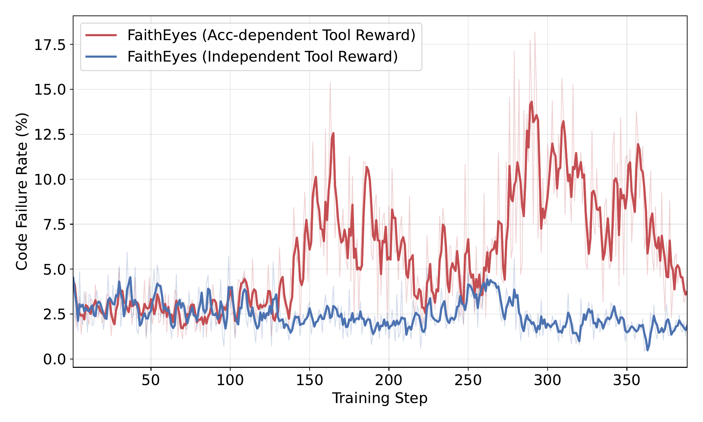
  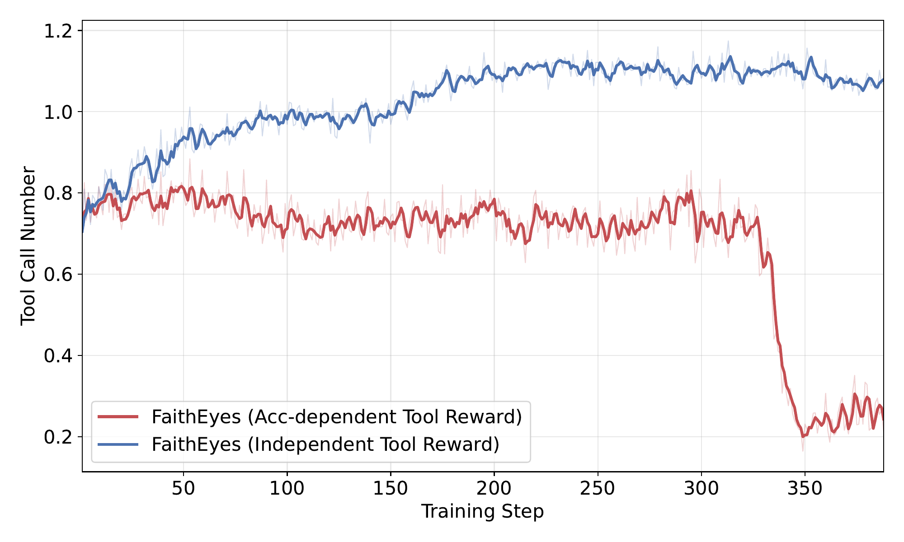
</p>

A natural design choice (adopted by prior works) is to grant the tool bonus only when the final answer is correct. Empirically, this **accuracy-dependent** variant exhibits pronounced spikes in the tool execution failure ratio (peaking at ~18%) and its average tool call number drops sharply toward zero — the policy degenerates into avoiding tool use altogether, since on hard questions no positive tool reward is available regardless of how well the tool is used. FaithEyes' **independent** tool reward always credits an executable and helpful call and always penalizes a failed one, keeping both the failure ratio and the tool usage stable throughout training.

### Training dynamics

<p align="center">
  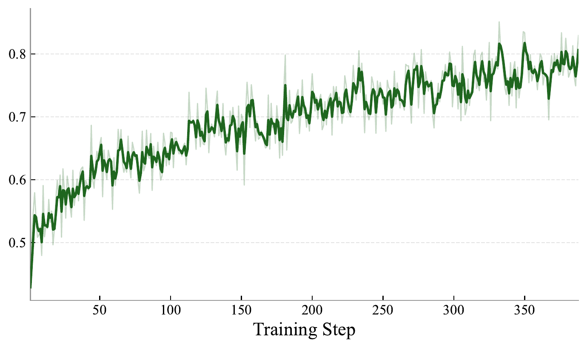
  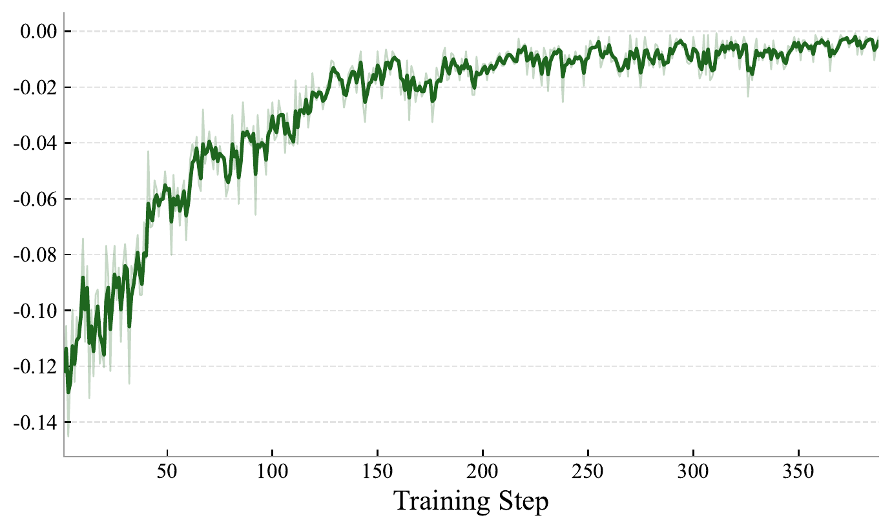
  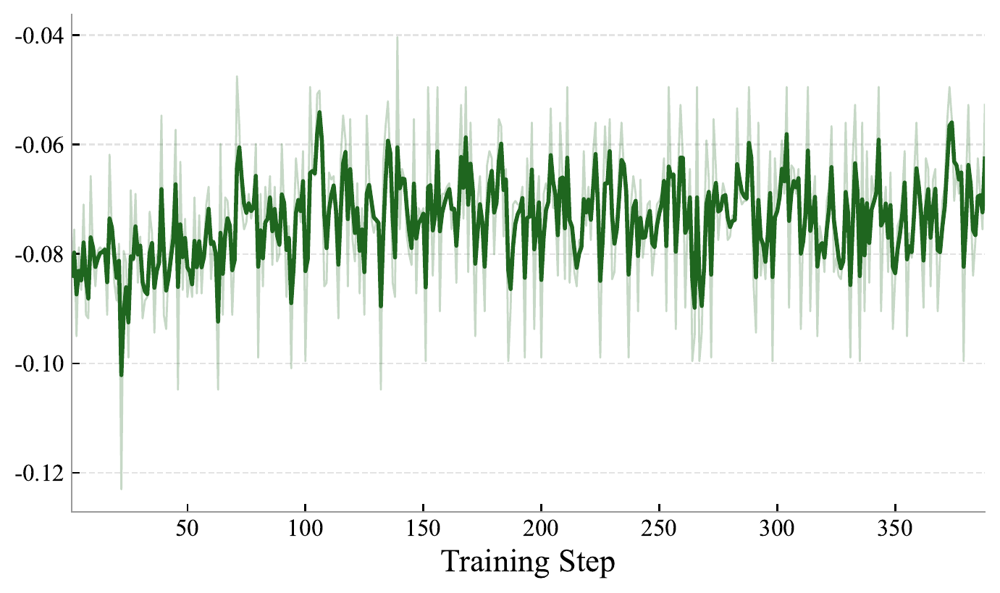
  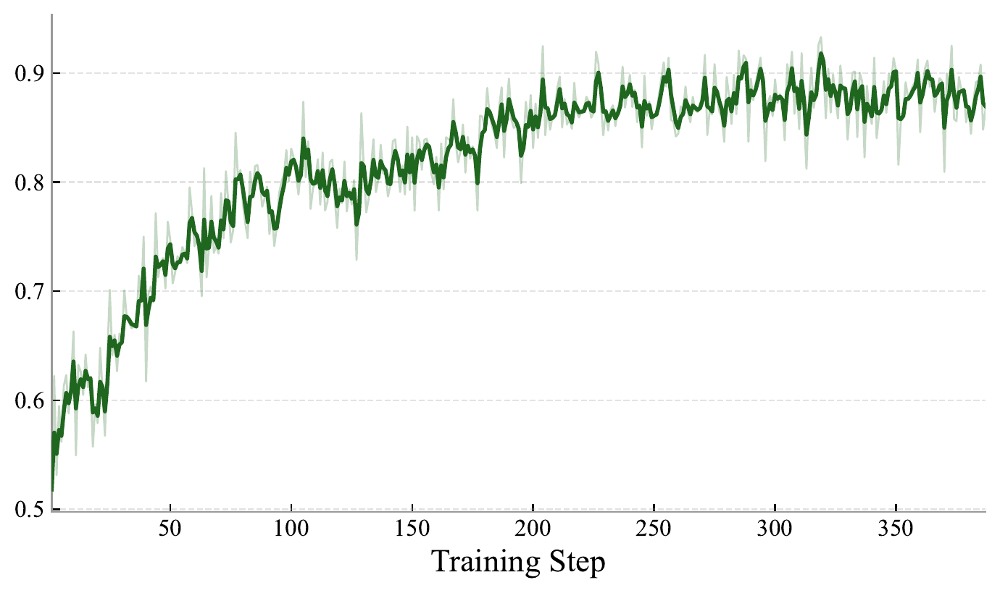
  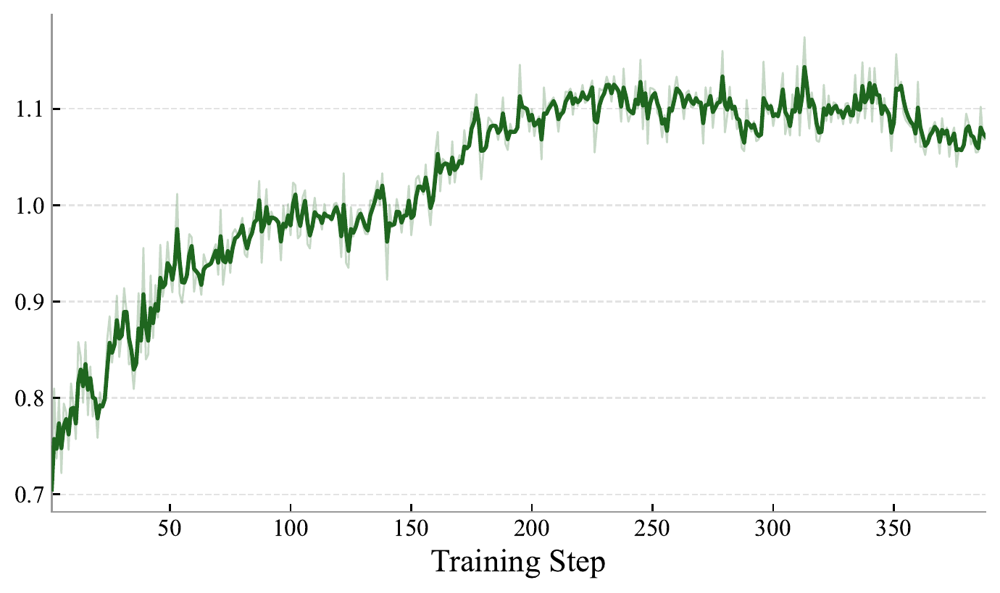
  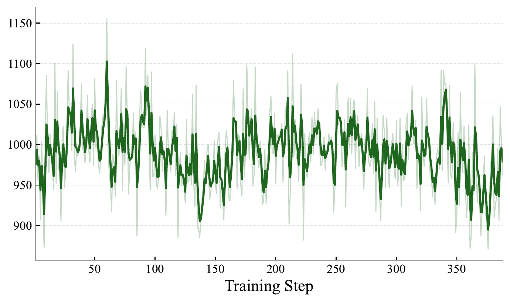
</p>

All four reward terms improve steadily and then plateau, without collapse. Most relevant to our objective, the tool reward (i.e., the helpful-tool ratio) grows steadily and stabilizes at a high level, so an increasing fraction of the invoked tools are both executable and judged helpful. The average tool call number converges to roughly **one focused, genuinely helpful call per trajectory** rather than over-invoking tools to farm a flat bonus, and the average response length stays essentially flat — the gains do not stem from length hacking but from more faithful on-target tool calls.

---

## 📚 Citation

If you find this work useful, please consider citing:

```bibtex
@article{wang2026faitheyes,
  title={FaithEyes: Towards Faithful Tool Use via Multi-Agent Process-Image Verification},
  author={Wang, Haoqing and Xing, Xingrun and Xia, Wei and Li, Ziheng and Tang, Yehui},
  journal={arXiv preprint arXiv:2607.28225},
  year={2026}
}
```

## 🙏 Acknowledgements

This project is developed on top of [verl](https://github.com/volcengine/verl), [DeepEyes](https://github.com/Visual-Agent/DeepEyes-RL), [Thyme](https://github.com/Kwai-Keye/Thyme), [ms_swift](https://github.com/modelscope/ms-swift), and [VLMEvalKit](https://github.com/open-compass/VLMEvalKit). We thank their authors for open-sourcing these projects.
